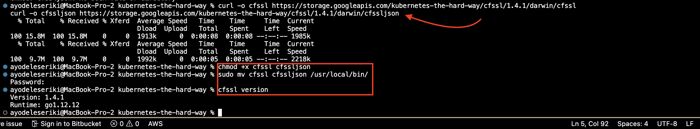
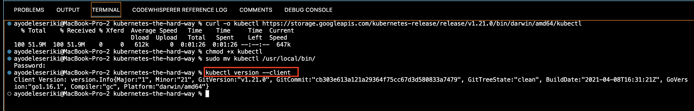

CLIENT TOOLS

Installing the required command line utilities : cfssl, cfssljson and kubectl

cfssl and cfssljson
===================

cfssl and cfssljson are used to provision PKI infrastructure and generate TLS certificates 

```
curl -o cfssl https://storage.googleapis.com/kubernetes-the-hard-way/cfssl/1.4.1/darwin/cfssl
curl -o cfssljson https://storage.googleapis.com/kubernetes-the-hard-way/cfssl/1.4.1/darwin/cfssljson

chmod +x cfssl cfssljson

sudo mv cfssl cfssljson /usr/local/bin/

#verify
cfssl version
cfssljson version
```


Installing Kubectl
==================

The kubectl command line utility is used to interact with the Kubernetes API Server.
```
curl -o kubectl https://storage.googleapis.com/kubernetes-release/release/v1.21.0/bin/darwin/amd64/kubectl
chmod +x kubectl
sudo mv kubectl /usr/local/bin/

#verify
kubectl version --client
```
